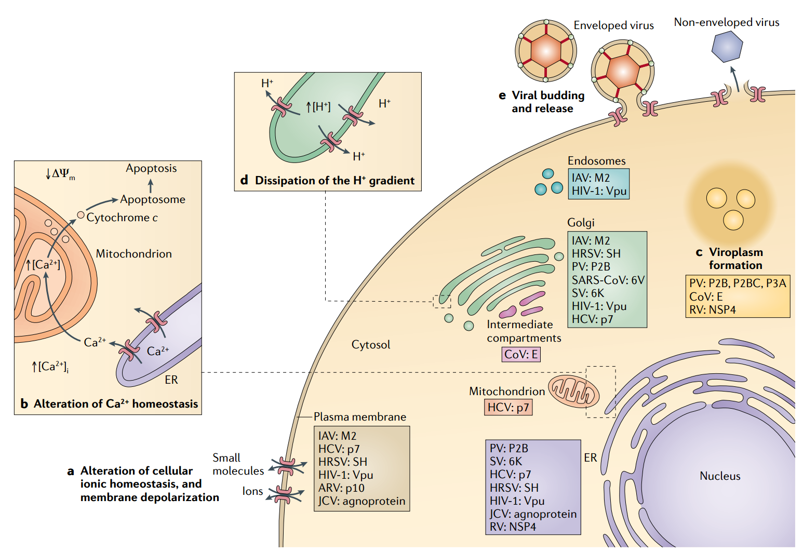

## Understanding SARS-CoV-2

### Questions:
- What are the exact roles of ORF1a and ORF1b?
- Is TM score (as defined by the Zhang lab https://zhanglab.ccmb.med.umich.edu/TM-score/ ) a good tool for estimating protein similarity (e.g. between Sars1, or MERS and Sars-cov-2)
- Is ORF3a (a viroporin encoding candidate) behind the disease phenotype?
	- What is this channel pearmeable to?
	- What are the basic electrophysiological properties of this specific viroporin?
		- Any known antagonists or perhaps modulators?
	- What class of viroporin are we talking about (following the classification scheme proposed by Nieva et al 2012)?	
	- what gates the channel?
- Is protein E (26245:26472) behind the viroporin (as suggested by Nieva et al 2012):
	- "(SARS-CoV). These viruses encode a small protein named envelope small membrane protein (E protein), which ranges from 76 to 109 amino acids in size44. It consists of a short hydrophilic domain (about 21–29 residues) preceding the transmembrane region, which is followed by a longer hydrophilic carboxyl tail. The amino-terminal 40 amino acids of SARS-CoV E protein are sufficient for the formation of ion channels that are selective for monovalent cations"
- Are both protein E and ORF3a ion channels (penta- and tetrameric respectively)?
	- If so, how do they interact?
- How perfect (or far from) is the RCB(receptor binding pocket) affinity to human ACE2?
	- how can one compare binding affinities between SARS-CoV-2 RCB and human ACE2 or bat ACE2 (or any other species)?
		- if through simulation, what kind?
- (RCB related): Is there an example of fully formed polybasic cleavage sites in any SARS-CoV-2-like virus (animal host) in the literature? Can a BLAST search help here?

### :books: References:
- "A new coronavirus associated with human respiratory disease in China" https://www.nature.com/articles/s41586-020-2008-3
	-  "The order of genes (5′ to 3′) was as follows:replicase ORF1ab, spike (S), envelope (E), membrane (M) and nucleocapsid (N)."
	-  "The predicted replicase ORF1ab gene of WHCV is 21,291 nt in length and contained 16 predicted non-structural proteins..followed by (at least) 13 downstream ORFs"
	-  "...the RBD(receptor-binding domain) of the spike protein from WHCV (_this is how they call SARS-CoV-2 in this first paper_) was only one aminoacid longer than the RBD of the spike protein from SARS-CoV"
- "The proximal origin of SARS-CoV-2" https://www.nature.com/articles/s41591-020-0820-9
	-	"SARS-CoV-2 appears to be optimized for binding to the human receptor ACE2; and (ii) the spike protein of SARSCoV-2 has a functional polybasic (furin) cleavage site at the S1–S2 boundary through the insertion of 12 nucleotides8, which additionally led to the predicted acquisition of three O-linked glycans around the site."
	-	"The receptorbinding domain (RBD) in the spike protein is the most variable part of the coronavirus genome"
	-	" The second notable feature of SARS-CoV-2 is a polybasic cleavage site (RRAR) at the junction of S1 and S2...The functional consequence of the polybasic cleavage site in SARS-CoV-2 is unknown"
	-	"Neither the bat betacoronaviruses nor the pangolin betacoronaviruses sampled thus far have polybasic cleavage sites"
- "Viroporins: structure and biological functions" https://www.nature.com/articles/nrmicro2820
	-	"Viroporins are small, hydrophobic proteins that are encoded by a wide range of clinically relevant animal viruses. When these proteins oligomerize in host cell membranes, they form hydrophilic pores that disrupt a number of physiological properties of the cell. Viroporins are crucial for viral pathogenicity"
	-	"Current hypotheses suggest that viroporins form aqueous channels following insertion into the host cell membrane and subsequent oligomerization. We propose that viroporins be classified into two major groups, class I and class II"
	 
	-	"(SARS-CoV). These viruses encode a small protein named envelope small membrane protein (E protein), which ranges from 76 to 109 amino acids in size44. It consists of a short hydrophilic domain (about 21–29 residues) preceding the transmembrane region, which is followed by a longer hydrophilic carboxyl tail."

- "Severe acute respiratory syndrome-associated coronavirus 3a protein forms an ion channel and modulates virus release" https://www.ncbi.nlm.nih.gov/pmc/articles/PMC1567914/
	-	"We observed that oocytes expressing 3a protein at their membrane surface led to a dramatic increase of membrane current over the entire potential range in 100 mM potassium solution (Fig. 4E). Therefore, in this study we focused only on testing whether 3a protein could serve as a potassium ion channel."
- "SARS coronavirus E protein forms cation-selective ion channels" https://www.sciencedirect.com/science/article/pii/S0042682204006440

-  "Coronavirus E protein forms ion channels with functionally and structurally-involved membrane lipids" https://www.ncbi.nlm.nih.gov/pmc/articles/PMC3438407/

- Kv10.1 model "Amino terminal-dependent gating of the potassium channel rat eag is compensated by a mutation in the S4 segment." https://www.ncbi.nlm.nih.gov/pubmed/9279806

#### A couple of studies on potential neurotrophic effects:
- "Neuroinvasive and Neurotropic Human Respiratory Coronaviruses: Potential Neurovirulent Agents in Humans" https://link.springer.com/chapter/10.1007%2F978-81-322-1777-0_6
- "Host strategies against virus entry via the olfactory system" https://www.tandfonline.com/doi/pdf/10.4161/viru.2.4.16138
 